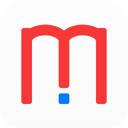

# Mildred



Mildred is a tool for managing your docker servers from your iOS devices. It includes an [iOS App](https://apps.apple.com/us/app/id1522800022) and a server-side.

## Why a server-side

The Mildred App connects your docker server via a server-side web app instead of the Docker REST API. The server-side web app can provide more features such as docker-compose, storage statistics, logs, alerts, notifications and more.

## Installation

Go to a folder you like on your docker server.

```bash
git clone https://github.com/dongyg/mildred.git
cd mildred && docker-compose up -d
```

## Configuration

>You can add any volumes setting to the YAML file as you want.

### docker-compose.yaml

Use the built image [`dongyg/mildred`](https://hub.docker.com/r/dongyg/mildred) which is automatically built from `Dockerfile`.

### docker-compose_mildred.yaml

If you want to build the docker image by yourself, you can create your own `docker-compose.yaml` based-on this file. Certainly, you can also modify the `Dockerfile` as you want.


## Expose via Nginx

You probably want to use the Nginx proxy instead of exposing the server directly to the internet. Here is an example.

```
server {
  listen 80;
  listen [::]:80;
  server_name 127.0.0.1 localhost;
  location /mildred/compose/ {  # Support chunked transfer
    proxy_pass                  http://192.168.0.100:8017;
    proxy_redirect              off;
    proxy_set_header            Host $host;
    proxy_set_header            X-Real-IP $remote_addr;
    proxy_set_header            X-Forwarded-For $proxy_add_x_forwarded_for;
    proxy_set_header            X-Forwarded-Proto $scheme;
    proxy_set_header            X-Forwarded-Host  $host;
    proxy_set_header            X-Forwarded-Port  $server_port;
    proxy_max_temp_file_size    0;
    proxy_buffering             off;
    chunked_transfer_encoding   on;
  }
  location /mildred/ {
    proxy_pass                  http://192.168.0.100:8017;
    proxy_redirect              off;
    proxy_set_header            Host $host;
    proxy_set_header            X-Real-IP $remote_addr;
    proxy_set_header            X-Forwarded-For $proxy_add_x_forwarded_for;
    proxy_set_header            X-Forwarded-Proto $scheme;
    proxy_set_header            X-Forwarded-Host  $host;
    proxy_set_header            X-Forwarded-Port  $server_port;
  }
}
```


## code-server

The [iOS App](https://apps.apple.com/us/app/id1522800022) also supports a connection to your self-hosted [`code-server`](https://github.com/cdr/code-server).

There are a couple of choices here: [codercom/code-server](https://hub.docker.com/r/codercom/code-server), [linuxserver/code-server](https://hub.docker.com/r/linuxserver/code-server)

Here is a snippet for using [linuxserver/code-server](https://hub.docker.com/r/linuxserver/code-server).

```yaml
version: "2.1"
services:
  code-server:
    image: linuxserver/code-server
    container_name: code-server
    environment:
      - PUID=1000
      - PGID=1000
      - TZ=Europe/London
      - PASSWORD=password #optional
      - SUDO_PASSWORD=password #optional
      - PROXY_DOMAIN=code-server.my.domain #optional
    volumes:
      - /path/to/appdata/config:/config
    ports:
      - 8443:8443
    restart: unless-stopped
```
